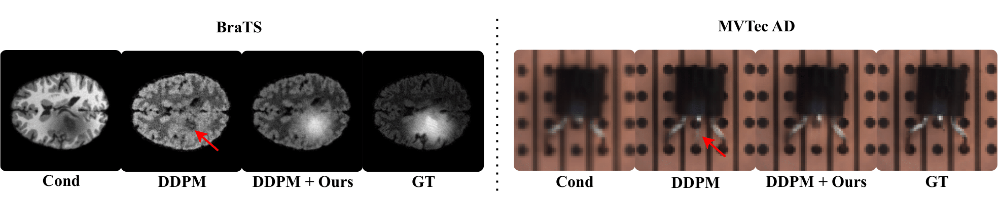
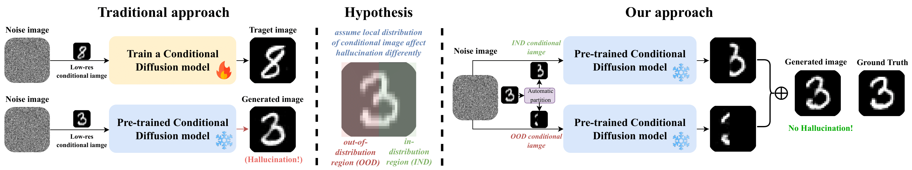
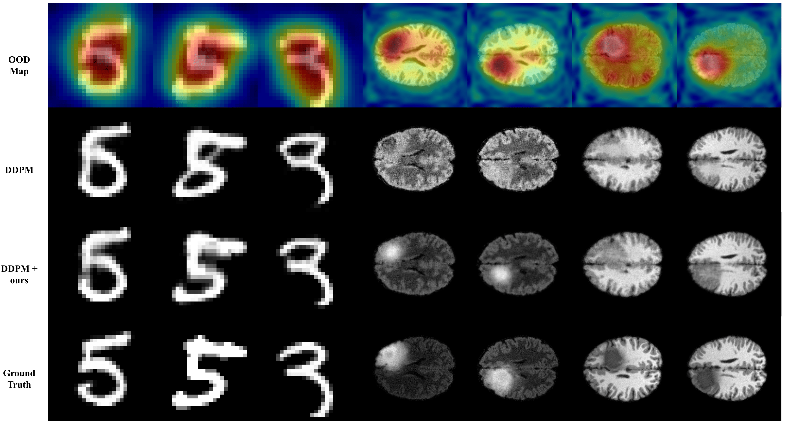
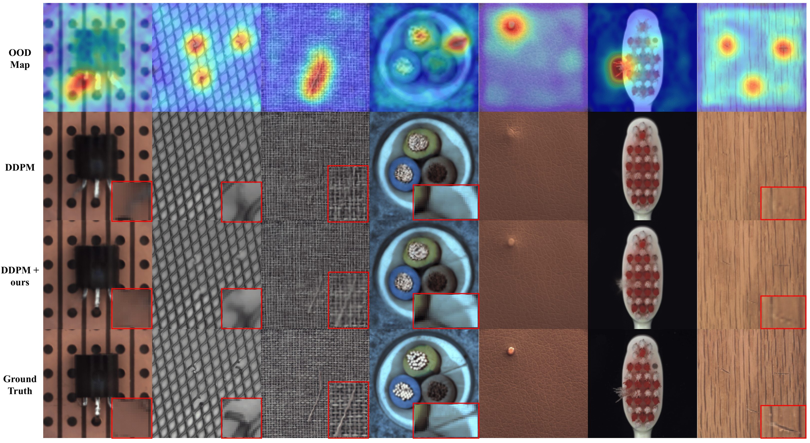

# Tackling Structural Hallucination in Image Translation with Local Diffusion (ECCV'24)
This is an official repository for the paper **'Tackling Structural Hallucination in Image Translation with Local Diffusion'**, which has been published to **ECCV 2024**.  
The code is still under development :)
# Background
Recent developments in diffusion models have advanced conditioned image generation, yet they struggle with reconstructing out-of-distribution (OOD) images, such as unseen tumors in medical images,
causing “image hallucination” and risking misdiagnosis. We hypothesize that **hallucinations are caused by local OOD regions in the conditional images**, and by partitioning the OOD area from in-distribution (IND) region and conducting separate generations, hallucinations can be alleviated.  

# Method
We propose a novel diffusion process aimed at reducing the hallucination in pre-trained diffusion models without any additional training with new data. To the best of our knowledge, this is the **first work to identify and tackle the hallucination problem in diffusion models for image translation**

# Results

