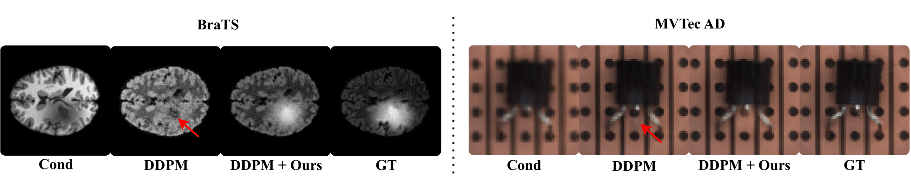
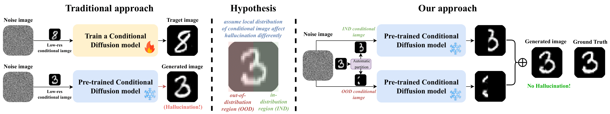
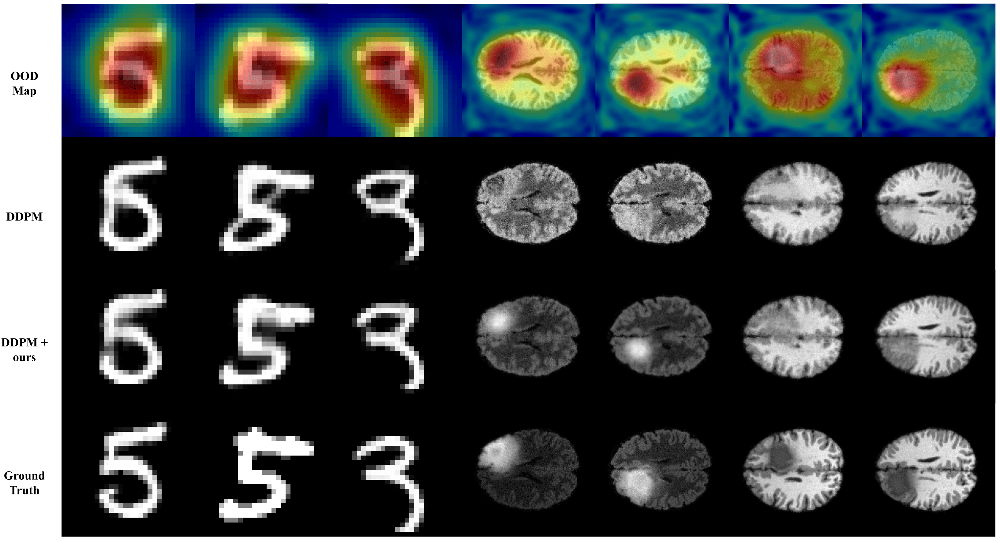
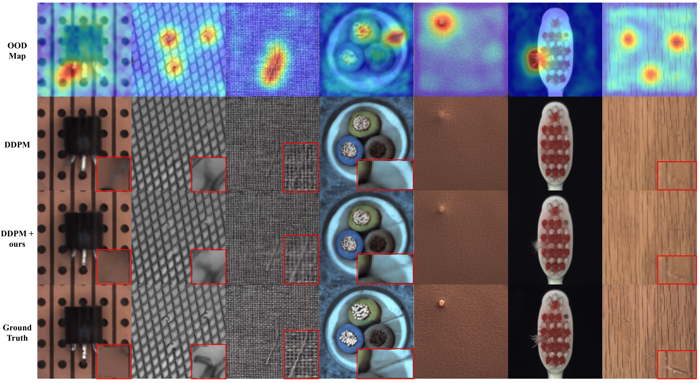

# Tackling Structural Hallucination in Image Translation with Local Diffusion (ECCV'24 Oral)

Official repository for **"Tackling Structural Hallucination in Image Translation with Local Diffusion"**, accepted to **ECCV 2024 (Oral)**.
[[arXiv]](https://arxiv.org/abs/2404.05980)

## Background

Recent developments in diffusion models have advanced conditioned image generation, yet they struggle with reconstructing out-of-distribution (OOD) images, such as unseen tumors in medical images, causing "image hallucination" and risking misdiagnosis. We hypothesize that **hallucinations are caused by local OOD regions in the conditional images**: by partitioning the OOD region from the in-distribution (IND) region and running separate generations, hallucinations can be alleviated.



## Method

We propose a **training-free** diffusion framework that reduces hallucination in *pre-trained* diffusion models. To the best of our knowledge, this is the first work to identify and tackle the hallucination problem in diffusion models for image translation. The pipeline is:

1. **OOD detection** — a [PatchCore](https://arxiv.org/abs/2106.08265) anomaly detector (or optionally a pre-trained segmentation network for MRI) produces an anomaly map of the conditional image, which is converted into a soft OOD-probability mask (`compute_ood_mask` in `test.py`).
2. **Branching** — the reverse diffusion runs as **two parallel branches**: one conditioned only on the OOD region, one conditioned (mostly) on the IND region, so the model never has to explain the unfamiliar region with in-distribution structures (`branching_out` / `model_predictions` in `ddpm.py`).
3. **Fusion** — near the end of sampling (once `t <= start_timestep`), the two branch predictions are stitched together with the OOD mask and the remaining reverse steps run jointly to produce one seamless image (`fusion` in `ddpm.py`). An optional PatchCore **classifier** can adaptively decide whether to accept the fused prediction or keep branching (`classifier` flag).



## Results

The method reduces misdiagnosis by 40% and 25% on real-world medical and natural image datasets respectively, and plugs into existing pre-trained diffusion models without any retraining.




## Repository structure

```
├── train.py                 # train the conditional diffusion model (IND data only)
├── test.py                  # test with local diffusion (OOD detection + branching + fusion)
├── anomaly_model_train.py   # pre-compute the PatchCore memory bank used by the OOD detector
├── configs/                 # yaml configs for every entry point (see comments inside)
├── ddpm.py                  # U-Net, Gaussian diffusion (branching/fusion sampling), Trainer
├── data.py                  # datasets: MNIST, BRATS (MedDataset*), MVTec
├── models.py                # PatchCore OOD detector + adaptive-fusion classifier
├── unet_model.py            # conditional-image encoder (ResUnet) and segmentation U-Net
├── utils.py                 # shared helpers (config loading, model builder, seeding)
├── train_seg.py             # optional: train the MRI tumor segmentation OOD detector
├── train_mnist_cls.py       # optional: MNIST classifier for the misdiagnosis evaluation
└── MNIST/                   # raw MNIST (included, so the MNIST demo runs out of the box)
```

## Installation

Python ≥ 3.9 with CUDA is recommended.

```bash
pip install -r requirements.txt
```

`anomalib` (pinned to 0.3.7 for its old module layout) is only needed at **test** time for OOD detection; training has no dependency on it.

## Usage

The MNIST setting (train on digit **8**, test on OOD digit **3**) works out of the box since the raw MNIST files ship with the repo.

### 1. Train the diffusion model on in-distribution data

```bash
python train.py --config configs/mnist_train.yaml     # MNIST 2x super-resolution
python train.py --config configs/brats_train.yaml     # BRATS T1 -> FLAIR translation
```

Checkpoints (`model-best<step>.pt`), the config snapshot, loss curves and sample outputs are written to `./results/<ProjectName>/`.

### 2. Pre-compute the PatchCore memory bank (OOD detector)

The OOD detector needs a memory bank of in-distribution features:

```bash
python anomaly_model_train.py --mode mnist
python anomaly_model_train.py --mode mri   --mri_files '/path/to/BRATS_png/normal/*flair.png'
python anomaly_model_train.py --mode mvtec --mvtec_files './mvtec/transistor/*/good/*.png' --obj transistor
```

Point `memory_bank_path` in your test config to the resulting `memory_bank_*.npy`.
For MRI you can alternatively use a pre-trained tumor segmentation network (`python train_seg.py`, then set `ood_detector.seg: True` and `ood_detector.seg_model` in the test config).

### 3. Test with local diffusion

```bash
python test.py --config configs/mnist_test.yaml
python test.py --config configs/brats_test.yaml
python test.py --config configs/mvtec_test.yaml
```

Make sure `ProjectName` and `train_phase` in the test config point at the trained checkpoint (`./results/<ProjectName>/model-best<train_phase>.pt`).
The script saves `hr_all.npy` (ground truth), `lr_all.npy` (conditional inputs), `pred_all.npy` (predictions) and `ad_masks.npy` (OOD masks) to `./results/<ProjectName>/test_outputs/`.

### Key config flags

| Key | Meaning |
| --- | --- |
| `ood` | test on OOD samples (`True`) or IND samples (`False`) |
| `ood_AD` | detect the OOD region automatically with PatchCore |
| `branch_out` | run the separate IND / OOD reverse-diffusion branches |
| `start_intermediate` / `start_timestep` | fuse the two branches once `t <= start_timestep` |
| `mask_x` | mask the OOD-branch prediction outside the OOD region |
| `classifier` | adaptive fusion: accept/reject the fused prediction with a PatchCore classifier |
| `ddim_timestep` | set `< timestep` for DDIM sampling, `False` for full DDPM |

Setting `ood_AD: False`, `branch_out: False` and `start_intermediate: False` recovers the vanilla conditional diffusion baseline.

Note: the OOD-mask thresholds in `compute_ood_mask` (`test.py`) are the per-dataset values calibrated for the experiments in the paper; new datasets require calibrating an entry threshold on the PatchCore anomaly scores.

## Requirements

See [`requirements.txt`](requirements.txt). Developed with Python 3.9.5 and `torch==1.12.1+cu113`.

## Citation

```bibtex
@inproceedings{kim2024tackling,
  title     = {Tackling Structural Hallucination in Image Translation with Local Diffusion},
  author    = {Kim, Seunghoi and Jin, Chen and Diethe, Tom and Figini, Matteo and Tregidgo, Henry F. J. and Mullokandov, Asher and Teare, Philip and Alexander, Daniel C.},
  booktitle = {European Conference on Computer Vision (ECCV)},
  year      = {2024}
}
```
